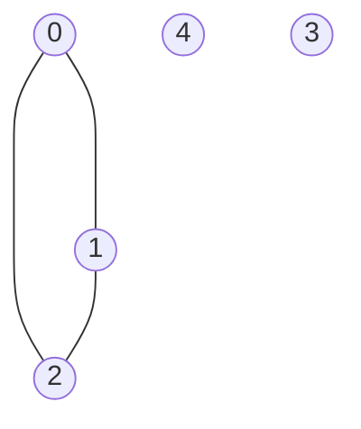
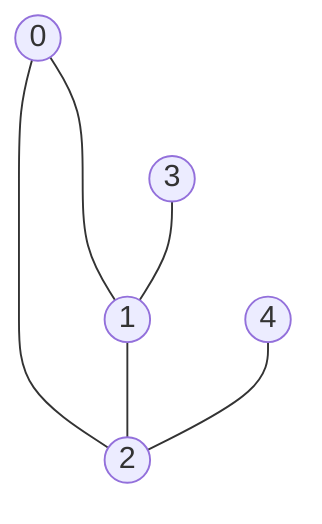
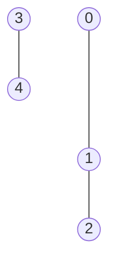
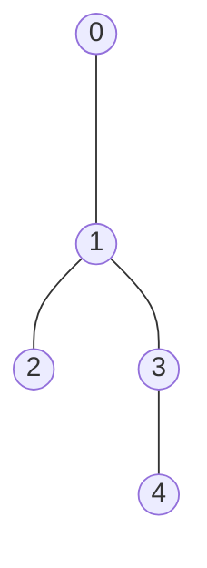

# Breadth-first search

## Purpose

The coding exercises are designed to test knowledge of the following concepts:

* The Breadth-first search approach for graph traversal

## Overview

The coding exercises cover the following practical problems:
* Calculating the number of connectivity components in a given undirected graph
* Checking whether a given directed graph has any cycles
* Finding all distances from a given graph vertex to other vertices

## Coding exercises

### Exercise 1: Calculate number of connectivity components in an undirected graph

Given the number of vertices `n` and graph edges (adjacency dictionary) `edges` for an undirected graph, write a function to calculate the number of connectivity components. Vertices are enumerated from `0` to `n-1`.

```python
def find_number_of_components(n: int, edges: Dict[int, Set]) -> int:
    """
    Returns the number of connectivity components in an undirected graph.
    Vertices are enumerated from 0 to N-1, there N - number of vertices.

    E.g. there is a graph with 6 vertices from 0 to 5 and edges {{0,1}, {1,5}, {5,0}, {3,4}},
    there are 3 connectivity components: {0, 5, 1}, {2}, {3,4}.
    Edges above will have the following 'adjacency dictionary' look: {0: {1,5}, 1: {0}, 3: {4}, 4: {3}, 5: {0}}.

    Parameters:
        n (int) : number of vertices in the graph, vertices are enumerated from 0 to n-1
        edges (Dict[int, Set]): adjacency dictionary which stores set of adjacent vertices for each vertex
    Returns:
        int: number of connectivity components in the given undirected graph
    """
    pass
```

**Example 1:**


Expected result: 3.

**Example 2:**


Expected result: 5.

**Example 3:**


Expected result: 1.

<br>

Please use a template for the implementation (`tasks/components:find_number_of_components`).


### Exercise 2: Check if graph has cycle

Given the number of vertices `n` and graph edges (adjacency dictionary) `edges` for an undirected graph, return True if graph contains any cycle, otherwise False. Vertices are enumerated from `0` to `n-1`.

```python
def check_cycle_existence(n: int, edges: Dict[int, Set]) -> bool:
    """
    Returns True if there is at least one cycle in the undirected graph.
    Vertices are enumerated from 0 to N-1, there N - number of vertices.

    E.g. there is graph with 6 vertices from 0 to 5 and edges {{0,1}, {1,5}, {5,0}, {3,4}},
    expected result is True because there is a cycle 0 - 1 - 5 - 0.

    Parameters:
        n (int) : number of vertices in the graph, vertices are enumerated from 0 to n-1
        edges (Dict[int, Set]): adjacency dictionary which stores set of adjacent vertices for each vertex
    Returns:
        bool: True if there is a cycle in the undirected graph, otherwise False
    """
    pass
```

**Example 1:**


Expected result: True.

**Example 2:**


Expected result: False.

**Example 3:**


Expected result: False.

<br>

Please use a template for the implementation (`tasks/cycle_existence:check_cycle_existence`).

### Exercise 3: Find all distances from the given vertex to all vertices

Given the number of vertices `n`, graph edges (adjacency dictionary) `edges` and an initial vertex `vertex` for an undirected graph, return a distance list where at index `i` there is the distance between vertices `vertex` and `i`. Vertices are enumerated from `0` to `n-1`. If there is no path from `vertex` to any vertex `i`, set the distance to `-1` at index `i`.


```python
def calculate_all_distances_from_vertex(n: int, edges: Dict[int, Set], vertex: int) -> List:
    """
    Returns list with minimum distances from vertex to all vertices, including itself.
    If there is no path, please set distance to -1.
    Vertices are enumerated from 0 to N-1, there N - number of vertices.

    E.g. you have graph with 4 vertices from 0 to 3 and edges {{0,1}, {1,2}). Initial vertex is 2,
    excepted result is [2, 1, 0, -1]. 2 at the 1st position (index 0) means that 2 edges needed to get from vertex '2'
    to vertex '0': 2 -> 1 -> 0. At the 2nd position (index 1) there is 1 because vertices '1' and '2' are adjacent.
    0 is placed on the 3rd place (index 2) because it's starting point and list is finished with -1 because
    there is no path between vertices '2' and '3'.

    Parameters:
        n (int) : number of vertices in the graph, vertices are enumerated from 0 to n-1
        edges (Dict[int, Set]): adjacency dictionary which stores set of adjacent vertices for each vertex
        vertex (int): initial vertex
    Returns:
        List: distance list which reflects distance between initial vertex and all other vertices,
        number at each index I shows the distance from starting vertex to vertex I
    """
    pass
```

**Example 1:**

`vertex` = 2

Expected result: [1, 1, 0, -1, -1].

**Example 2:**

`vertex` = 4

Expected result: [-1, -1, -1, -1, 0].

**Example 3:**

`vertex` = 0

Expected result: [0, 1, 2, 2, 3].

<br>

Please use a template for the implementation (`tasks/all_distances:calculate_all_distances_from_vertex`).
