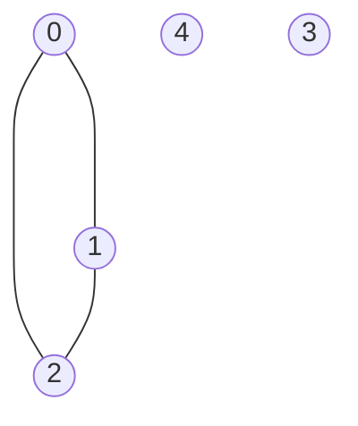
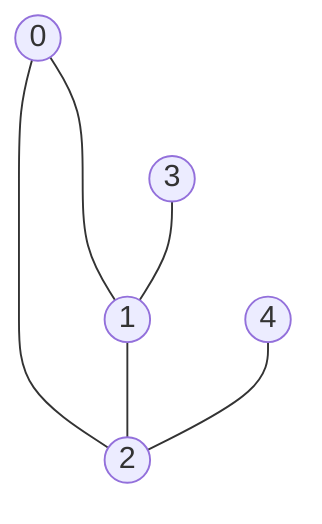
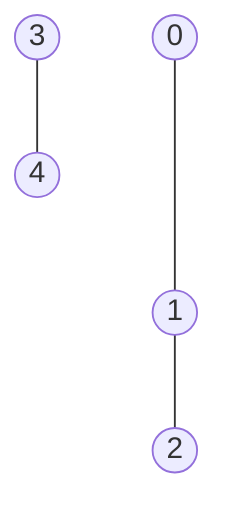
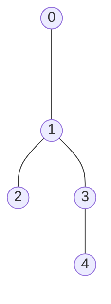

# Breadth-first search
Set of programming assignments that are designed to test knowledge of BFS traversal for graphs.

## Problem 1: Calculate number of connectivity components in an undirected graph

Given the number of vertices `n` and graph edges (adjacency dictionary) `edges` for an undirected graph, write a function to calculate the number of connectivity components. Vertices are enumerated from `0` to `n-1`.

**Example 1:**

Expected result: 3.

**Example 2:**

Expected result: 5.

**Example 3:**

Expected result: 1.

Please use a template for the implementation (`tasks/components:find_number_of_components`).

## Problem 2: Check if graph has cycle

Given the number of vertices `n` and graph edges (adjacency dictionary) `edges` for an undirected graph, return True if graph contains any cycle, otherwise False. Vertices are enumerated from `0` to `n-1`.

**Example 1:**

Expected result: True.

**Example 2:**

Expected result: False.

**Example 3:**

Expected result: False.

Please use a template for the implementation (`tasks/cycle_existence:check_cycle_existence`).

## Problem 3: Find all distances from the given vertex to all vertices

Given the number of vertices `n`, graph edges (adjacency dictionary) `edges` and an initial vertex `vertex` for an undirected graph, return a distance list where at index `i` there is the distance between vertices `vertex` and `i`. Vertices are enumerated from `0` to `n-1`. If there is no path from `vertex` to any vertex `i`, set the distance to `-1` at index `i`.

**Example 1:**

`vertex` = 2

Expected result: [1, 1, 0, -1, -1].

**Example 2:**

`vertex` = 4

Expected result: [-1, -1, -1, -1, 0].

**Example 3:**

`vertex` = 0

Expected result: [0, 1, 2, 2, 3].

Please use a template for the implementation (`tasks/all_distances:calculate_all_distances_from_vertex`).
